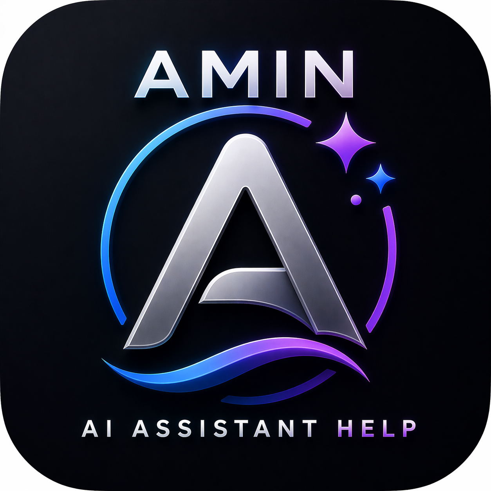
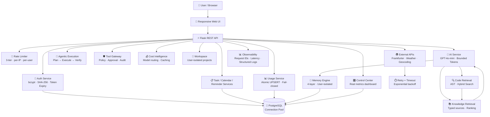
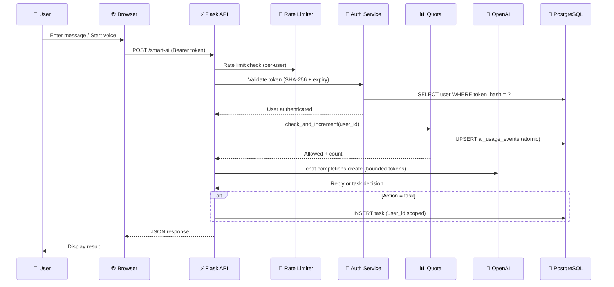
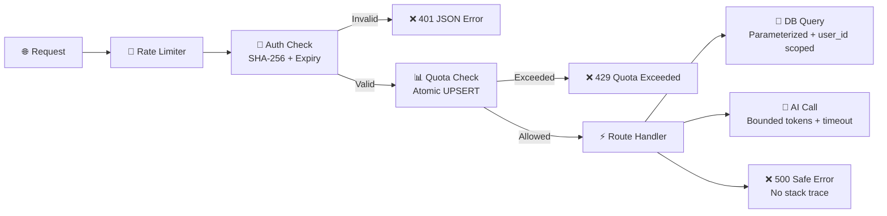
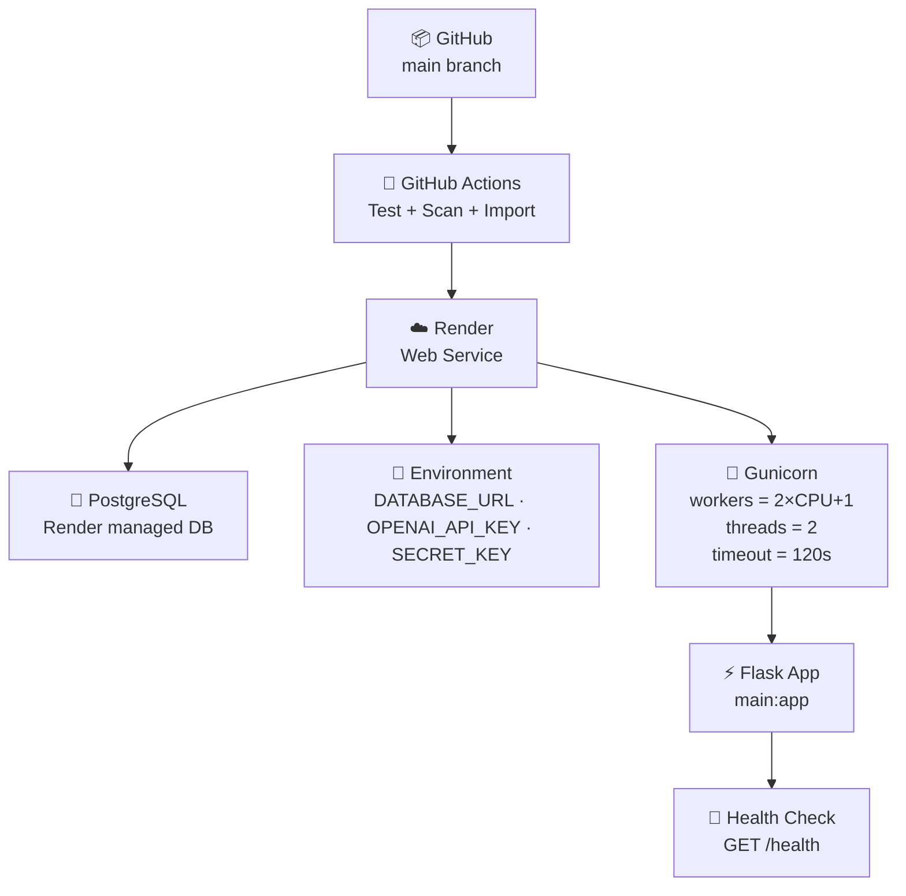

<div align="center">

# 🧠 Personal AI Assistant

### An AI-assisted productivity workspace for tasks, appointments, reminders, voice interaction, and real-time daily context.

[](https://personal-ai-assistent.onrender.com)
[](https://www.python.org/)
[](https://flask.palletsprojects.com/)
[](https://www.postgresql.org/)
[](https://platform.openai.com/)
[](https://render.com/)
[](LICENSE)
[](#testing--quality)
[](#release--change-log)

**Production-Grade · Security-Hardened · AI-Native · REST API · 20-Phase Engineered**

[🌐 Live Demo](https://personal-ai-assistent.onrender.com) ·
[📦 GitHub](https://github.com/aminazimi42-coder/Personal-ai-assistent) ·
[📖 API Docs](#api-documentation) ·
[🔒 Security Model](#security-model) ·
[🚀 Quick Start](#quick-start) ·
[🗺️ Roadmap](#roadmap)

</div>

---

## 📋 Table of Contents

1. [Product Vision](#product-vision)
2. [Capability Matrix](#capability-matrix)
3. [Screenshot Showcase](#screenshot-showcase)
4. [Architecture](#architecture)
5. [End-to-End Flow](#end-to-end-flow)
6. [Technology Stack](#technology-stack)
7. [Security Model](#security-model)
8. [AI / Retrieval / Token Architecture](#ai--retrieval--token-architecture)
9. [Testing & Quality](#testing--quality)
10. [API Documentation](#api-documentation)
11. [Deployment Architecture](#deployment-architecture)
12. [Configuration](#configuration)
13. [License](#license)
14. [Roadmap](#roadmap)
15. [Release & Change Log](#release--change-log)

---

## Product Vision

> **Reduce daily cognitive load by bringing planning, contextual information, reminders, AI-assisted actions, and intelligent retrieval into one focused, secure workspace.**

Personal AI Assistant is a production-grade, security-hardened AI-native productivity platform. It combines structured task and appointment workflows with conversational AI, voice transcription, code retrieval, layered memory, agentic task execution, tool-gated automation, and a real-time control center — all built on Flask + PostgreSQL with 384 passing tests and deployed on Render.

---

## Capability Matrix

| # | Capability | Status | Description |
|---|---|---|---|
| 1 | **Task Management** | ✅ Complete | CRUD with user isolation, priority, due dates, status validation |
| 2 | **Appointment Scheduling** | ✅ Complete | CRUD with user isolation, location, status, time validation |
| 3 | **Reminder Aggregation** | ✅ Complete | Tasks + appointments due within 1-hour window (UTC-aware) |
| 4 | **AI Chat** | ✅ Complete | GPT-4o-mini conversational AI with bounded tokens |
| 5 | **Smart AI** | ✅ Complete | Single-LLM-call decision: reply vs. task creation |
| 6 | **AI-to-Task** | ✅ Complete | Natural-language task extraction with structured output |
| 7 | **Voice Transcription** | ✅ Complete | OpenAI Whisper integration with upload validation |
| 8 | **Authentication** | ✅ Complete | bcrypt, SHA-256 token hashing, expiry, revocation |
| 9 | **Rate Limiting** | ✅ Complete | 3-tier Flask-Limiter (login, AI, general) |
| 10 | **AI Quota** | ✅ Complete | Per-user daily quota, atomic UPSERT, fail-closed in prod |
| 11 | **External API Reliability** | ✅ Complete | Bounded retries, exponential backoff, timeouts, URL redaction |
| 12 | **Code Retrieval** | ✅ Complete | AST symbol extraction, hybrid search, context compression, token counting |
| 13 | **Memory Engine** | ✅ Complete | 4-layer memory (short_term, task, preference, project), user-isolated |
| 14 | **Agentic Execution** | ✅ Complete | Plan → Execute → Verify pipeline with approval gates |
| 15 | **Tool Gateway** | ✅ Complete | Policy-based tool access, least privilege, audit logging |
| 16 | **Cost & Token Intelligence** | ✅ Complete | Model routing, token budgets, response caching, cost estimation |
| 17 | **Project Workspace** | ✅ Complete | User-owned workspaces with project hierarchy and isolation |
| 18 | **Unified Knowledge Retrieval** | ✅ Complete | Typed sources, ranking, token-budgeted context assembly |
| 19 | **Verification Engine** | ✅ Complete | Evidence-based verification, no-fabricated-success guard |
| 20 | **Automation** | ✅ Complete | Triggers, idempotency, daily limits, execution logging |
| 21 | **Privacy Controls** | ✅ Complete | Data classification, retention policies, audit logging |
| 22 | **Control Center** | ✅ Complete | Real metrics dashboard from live service state |
| 23 | **Exchange Rates** | ✅ Complete | Frankfurter API integration with graceful degradation |
| 24 | **Weather & Location** | ✅ Complete | Browser geolocation, Open-Meteo weather, Nominatim geocoding |

---

## Screenshot Showcase

> Real screenshots from the deployed application on Render.

<div align="center">

### 🏠 Home Dashboard


*Time-aware greeting, weather, live location, and exchange-rate summary*

---

### ✅ Tasks & Productivity


*Task management with priority, status, and due-date controls*

---

### 🤖 AI Interaction


*Conversational AI, voice transcription, and smart task creation*

---

### 🎨 App Icon



*Application icon — LILA / ALINA companion avatar*

</div>

---

## Architecture



### Architectural Layers

| Layer | Files | Responsibility |
|---|---|---|
| **Entry Point** | `main.py` | Flask app factory, middleware, error handlers |
| **Configuration** | `config/settings.py` | Centralized, validated environment config |
| **DB Pool** | `db/pool.py` | ThreadedConnectionPool (psycopg2) |
| **DB Models** | `db/models.py` | SQLAlchemy schema (Flask-Migrate) |
| **Migrations** | `migrations/versions/` | 4 Alembic migrations |
| **Routes** | `routes/*.py` | HTTP endpoints, auth checks, response orchestration |
| **Services** | `services/*.py` | Domain logic, AI, memory, retrieval, tools, security |
| **Utils** | `utils/datetime_utils.py`, `utils/validators.py` | Shared helpers |
| **Frontend** | `templates/index.html`, `static/` | Responsive SPA, CSS, JS |
| **Tests** | `tests/` | 384 tests across 27 modules |
| **CI** | `.github/workflows/ci.yml` | GitHub Actions pipeline |
| **Deploy** | `Procfile`, `gunicorn.conf.py`, `render.yaml` | Render deployment |

---

## End-to-End Flow



---

## Technology Stack

| Category | Technology | Version | Role |
|---|---|---|---|
| **Runtime** | Python | 3.11.9 | Application runtime |
| **Backend** | Flask | 3.0.3 | HTTP routing, REST API, app factory |
| **ORM/Migrations** | Flask-SQLAlchemy + Flask-Migrate | 3.1.1 + 4.0.7 | Schema management (Alembic) |
| **Rate Limiting** | Flask-Limiter | 3.5.1 | 3-tier rate limiting |
| **Database** | PostgreSQL | — | Persistent relational storage |
| **DB Driver** | psycopg2-binary | 2.9.9 | ThreadedConnectionPool |
| **AI** | OpenAI Python SDK | 1.30.1 | GPT-4o-mini, Whisper |
| **Security** | bcrypt | 4.1.2 | Password hashing |
| **HTTP** | requests | 2.31.0 | External API calls |
| **Server** | Gunicorn | 21.2.0 | WSGI production server |
| **Frontend** | HTML5 + CSS3 + Vanilla JS | — | Responsive SPA |
| **Browser APIs** | Geolocation · MediaRecorder · Notifications | — | Location, voice, reminders |
| **CI/CD** | GitHub Actions | — | Test + secret scan + import smoke |
| **Deployment** | Render | — | Cloud hosting |

---

## Security Model

| Control | Implementation | Verified By |
|---|---|---|
| **Password Storage** | bcrypt (cost factor 12) | `test_security_hardening.py` |
| **Token Storage** | SHA-256 hash, raw token never persisted | `test_auth_service.py` |
| **Token Expiry** | Enforced at query time (`token_expires_at > NOW()`) | `test_auth_service.py` |
| **Token Revocation** | Immediate — nulls hash on logout | `test_api_routes.py` |
| **Anti-Enumeration** | Same error for bad email / bad password | `test_security_hardening.py` |
| **SQL Injection** | Parameterized queries throughout (`%s` placeholders) | `test_security_hardening.py` |
| **CORS** | Restrictive — configured origins only, no wildcards | `test_production_env.py` |
| **Security Headers** | X-Content-Type-Options, X-Frame-Options, Referrer-Policy | `test_security_hardening.py` |
| **Error Handling** | Global JSON handlers — never expose stack traces | `test_api_routes.py` |
| **Rate Limiting** | 3-tier: login (10/min), AI (20/min), general (60/min) | `test_rate_limiter.py` |
| **AI Quota** | Per-user daily, atomic UPSERT, fail-closed in production | `test_usage_service.py` |
| **Upload Limits** | Voice: 10 MB max, MIME-type validated | `test_api_routes.py` |
| **Input Limits** | AI messages: 4000 chars max, output tokens bounded | `test_ai_service.py` |
| **Secrets** | Environment variables only, validated at startup | `test_config.py` |
| **Debug Mode** | Disabled in production (`FLASK_ENV=production`) | `test_production_env.py` |
| **User Isolation** | All queries scoped by `user_id` | `test_user_isolation.py` |
| **Tool Permissions** | Least-privilege registry, approval for destructive | `test_tool_gateway.py` |
| **Prompt Injection** | Retrieved content treated as untrusted, query sanitized | `test_code_retrieval.py` |

### Security Architecture



---

## AI / Retrieval / Token Architecture

### AI Pipeline

| Stage | Component | Behavior |
|---|---|---|
| **Input Validation** | Route handlers | Length check, message required, JSON required |
| **Quota Check** | `usage_service.check_and_increment()` | Atomic UPSERT, fail-closed in prod |
| **Model Selection** | `cost_intelligence.select_model()` | Simple → gpt-4o-mini, complex → gpt-4o |
| **Token Budget** | `cost_intelligence.compute_token_budget()` | Context budget minus output reservation |
| **AI Call** | `ai_service.generate_ai_reply()` | Bounded `max_tokens`, timeout, structured logging |
| **Output Validation** | `_clean_text()`, `_extract_json()` | Safe fallback on parse failure |
| **Metadata Logging** | `logger.info()` | Model, tokens, duration — no prompt content |

### Retrieval Pipeline

```
USER REQUEST → QUERY SANITIZATION → REPOSITORY INGESTION →
AST SYMBOL EXTRACTION → HYBRID SEARCH (keyword + symbol) →
RELEVANCE RANKING (type-weighted) → CONTEXT COMPRESSION →
TOKEN-BUDGET GUARD → LLM → RESPONSE
```

| Component | Key Features |
|---|---|
| **Code Retrieval** | AST parsing, hybrid search, context compression, tiktoken counting |
| **Memory Engine** | 4-layer (short_term/task/preference/project), user-isolated, TTL |
| **Knowledge Retrieval** | Typed sources (code/memory/task/note/project), ranked, token-budgeted |
| **Cost Intelligence** | Model routing, response caching with TTL, cost estimation |
| **Tool Gateway** | Policy registry (read_only/write/destructive/communication), approval gates |

---

## Testing & Quality

| Metric | Value |
|---|---|
| **Total Tests** | 384 |
| **Test Modules** | 27 |
| **Pass Rate** | 100% (384/384) |
| **External Dependencies** | None (no real DB or OpenAI calls) |
| **Test Framework** | pytest 8.2.2 + pytest-mock 3.14.0 |

### Test Matrix

| Module | Tests | Coverage Area |
|---|---|---|
| `test_code_retrieval.py` | 28 | AST extraction, hybrid search, compression, tokens |
| `test_security_hardening.py` | 27 | Token hashing, bcrypt, CORS, headers, SQL injection |
| `test_api_routes.py` | 25 | Route integration, auth, errors, CORS, upload limits |
| `test_memory_engine.py` | 19 | 4-layer memory, CRUD, search, expiry, isolation |
| `test_final_regression.py` | 19 | Full regression across all modules |
| `test_ai_service.py` | 19 | AI reply, JSON extraction, smart action, fallbacks |
| `test_production_deployment.py` | 18 | E2E smoke tests, deployment config |
| `test_auth_service.py` | 18 | Token gen, hashing, validation, email/password |
| `test_task_service.py` | 17 | Task payload, serialization, validation |
| `test_agentic_execution.py` | 17 | Action registry, approval, execution, status |
| `test_workspace.py` | 16 | Workspace CRUD, project CRUD, isolation |
| `test_privacy.py` | 16 | Data classification, policies, audit, anonymization |
| `test_tool_gateway.py` | 15 | Tool registry, policy enforcement, approval |
| `test_cost_intelligence.py` | 15 | Model routing, caching, cost estimation |
| `test_production_env.py` | 14 | Config validation, gunicorn, render.yaml |
| `test_automation.py` | 14 | Triggers, idempotency, daily limits, logging |
| `test_migration_safety.py` | 13 | Chain, syntax, additive upgrade, FK, downgrade |
| `test_control_center.py` | 13 | Dashboard metrics, health summary |
| `test_verification_engine.py` | 11 | Verification states, evidence, no-fabricated-success |
| `test_knowledge_retrieval.py` | 10 | Typed sources, ranking, token budget |
| `test_phase2_4_fixes.py` | 9 | Per-user rate limit, fail-closed quota, browser timeout |
| `test_external_api.py` | 9 | Retry, backoff, timeout, URL redaction |
| `test_usage_service.py` | 8 | Quota, increment, reset, concurrency |
| `test_rate_limiter.py` | 7 | 3-tier limits, 429 semantics, configurable |
| `test_config.py` | 4 | Environment config validation |
| `test_user_isolation.py` | 3 | Cross-user access prevention |

### CI Pipeline

GitHub Actions CI runs on every push to `main`/`develop` and every PR to `main`:

1. **Dependency install** — `pip install -r requirements.txt`
2. **Secret scan** — scans tracked files for API keys
3. **Full test suite** — `pytest tests/ -v --tb=short`
4. **Import smoke check** — verifies all modules import cleanly
5. **Migration validation** — all migration files parse as valid Python

---

## API Documentation

### Platform Endpoints

| Method | Endpoint | Auth | Description |
|---|---|---|---|
| `GET` | `/` | No | Serve the application |
| `GET` | `/health` | No | Liveness probe (`{"status":"ok"}`) |
| `GET` | `/ready` | No | Readiness probe (checks DB connectivity) |
| `GET` | `/app-info` | No | App metadata (name, version, author) |
| `GET` | `/exchange-rates` | No | USD exchange rates (Frankfurter API) |

### Authentication

| Method | Endpoint | Auth | Description |
|---|---|---|---|
| `POST` | `/signup` | No | Create account → returns `token` |
| `POST` | `/login` | No | Authenticate → returns `token` |
| `POST` | `/logout` | Yes | Revoke current token |
| `GET` | `/me` | Yes | Current user profile |
| `GET` | `/me/usage` | Yes | Today's AI usage and quota |

### Tasks

| Method | Endpoint | Auth | Description |
|---|---|---|---|
| `GET` | `/tasks` | Yes | List user's tasks |
| `POST` | `/tasks` | Yes | Create a task |
| `PUT` | `/tasks/{id}` | Yes | Update a task |
| `DELETE` | `/tasks/{id}` | Yes | Delete a task |

### Appointments

| Method | Endpoint | Auth | Description |
|---|---|---|---|
| `GET` | `/appointments` | Yes | List user's appointments |
| `POST` | `/appointments` | Yes | Create an appointment |
| `PUT` | `/appointments/{id}` | Yes | Update an appointment |
| `DELETE` | `/appointments/{id}` | Yes | Delete an appointment |

### Reminders & AI

| Method | Endpoint | Auth | Description |
|---|---|---|---|
| `GET` | `/reminders` | Yes | Tasks/appointments due in next hour |
| `POST` | `/ai` | Yes | Conversational AI chat |
| `POST` | `/smart-ai` | Yes | Smart AI: reply or create task |
| `POST` | `/ai-to-task` | Yes | Extract task from natural language |
| `POST` | `/transcribe-voice` | Yes | Voice → text (OpenAI Whisper) |

> **Auth:** All protected endpoints require `Authorization: Bearer <token>` header.
> Tokens are 48-byte URL-safe random values, stored as SHA-256 hashes, with configurable expiry (default 24h).

---

## Deployment Architecture



| Setting | Value |
|---|---|
| **Runtime** | Python 3.11.9 |
| **Build** | `pip install -r requirements.txt` |
| **Start** | `gunicorn main:app --config gunicorn.conf.py` |
| **Health check** | `GET /health` |
| **DB** | Render managed PostgreSQL (free tier) |
| **Secrets** | `OPENAI_API_KEY`, `CORS_ALLOWED_ORIGINS` set in dashboard |

🌐 **Live application:** https://personal-ai-assistent.onrender.com

> Free-tier cloud instances may require a short warm-up period after inactivity.

---

## Configuration

All configuration is centralized in `config/settings.py` and read from environment variables. See `.env.example` for the complete list.

### Required

| Variable | Description |
|---|---|
| `DATABASE_URL` | PostgreSQL connection string |
| `OPENAI_API_KEY` | OpenAI API key |

### Important

| Variable | Default | Description |
|---|---|---|
| `SECRET_KEY` | `dev-insecure-change-in-production` | Flask secret key |
| `FLASK_ENV` | `development` | `development` or `production` |
| `CORS_ALLOWED_ORIGINS` | localhost (dev) | Comma-separated allowed origins |
| `OPENAI_CHAT_MODEL` | `gpt-4o-mini` | OpenAI model |
| `AUTH_TOKEN_EXPIRY_SECONDS` | `86400` (24h) | Token lifetime |
| `RATE_LIMIT_LOGIN` | `10` | Login attempts per minute per IP |
| `RATE_LIMIT_AI` | `20` | AI requests per minute per user |
| `RATE_LIMIT_GENERAL` | `60` | General requests per minute per IP |
| `AI_DAILY_QUOTA_PER_USER` | `0` (unlimited) | Daily AI call limit per user |
| `AI_MAX_TOKENS` | `1024` | Max output tokens per AI response |
| `AI_MAX_INPUT_CHARS` | `4000` | Max input message length |
| `AI_REQUEST_TIMEOUT` | `30` | OpenAI request timeout (seconds) |
| `VOICE_MAX_UPLOAD_BYTES` | `10485760` (10 MB) | Max voice upload size |
| `DB_POOL_MIN` | `1` | Min DB pool connections |
| `DB_POOL_MAX` | `10` | Max DB pool connections |
| `LOG_LEVEL` | `INFO` | Logging verbosity |

---

## License

This project is licensed under the **Apache License 2.0**.

- ✅ Commercial use
- ✅ Modification
- ✅ Distribution
- ✅ Patent grant
- ❌ Trademark use
- ❌ Liability / warranty

See [LICENSE](LICENSE) for the full text.

> Third-party dependencies retain their own licenses. This license does not
> override third-party licenses or transfer ownership.

---

## Roadmap

> The following stages are **future-only** — not part of the current release.
> After the development freeze, no roadmap work is implemented in this release.

### ROADMAP 01 — Cognitive Memory Graph

- **Objective:** Temporal, provenance-aware personal knowledge graph connecting person, preference, project, task, conversation, decision, document, code, and outcome
- **User Value:** The assistant remembers not just facts but relationships — how a task connects to a project, how a decision connects to an outcome, and when information becomes stale
- **Architectural Impact:** New graph data model extending the current 4-layer memory engine; relationship traversal and conflict detection
- **Dependencies:** PostgreSQL graph capabilities or dedicated graph store; provenance metadata schema
- **Security/Privacy:** Provenance must respect user isolation; relationship data classified as confidential; retention policies per edge type
- **Success Criteria:** 95% recall on temporal queries; <100ms relationship traversal; user-controlled provenance deletion

### ROADMAP 02 — Decision & Simulation Lab

- **Objective:** Structured what-if scenario modeling before consequential actions — options, assumptions, expected effects, risks, dependencies, uncertainty, and verification plans
- **User Value:** Users can evaluate decisions (e.g., "what if I reschedule this project?") with AI-generated scenarios before committing
- **Architectural Impact:** New scenario engine with Monte-Carlo-style outcome projection; integration with task and appointment systems
- **Dependencies:** Cost intelligence (for AI budget per scenario); verification engine (for outcome validation)
- **Security/Privacy:** Scenario data is user-isolated; no external data leaves the system without consent; simulation results may contain sensitive projections
- **Success Criteria:** Scenario generation < 5s; outcome accuracy > 70% on retrospective validation; user can compare ≥ 3 scenarios side-by-side

### ROADMAP 03 — AI Context Compiler

- **Objective:** Dedicated context compiler assembling minimum-sufficient, permission-aware, evidence-backed context from memory, projects, code, documents, tasks, and history — optimizing relevance, freshness, provenance, token budget, and cost
- **User Value:** AI responses are grounded in the right context — not too much (expensive, slow) and not too little (incomplete, wrong)
- **Architectural Impact:** Unified context assembly layer above existing knowledge retrieval; inspectable context packages; provenance tracking
- **Dependencies:** Code retrieval, memory engine, knowledge retrieval, cost intelligence (token budgeting)
- **Security/Privacy:** Context packages respect user isolation; retrieved content treated as untrusted; provenance visible to user
- **Success Criteria:** Context assembly < 200ms; ≥ 30% token reduction vs. full-context baseline; zero provenance gaps

### ROADMAP 04 — Continuous AI Evaluation Lab

- **Objective:** Versioned benchmarks for retrieval quality, memory relevance, tool safety, hallucination resistance, instruction following, latency, tokens, cost, security, and regression
- **User Value:** Quality is measured, not assumed — every model change is evaluated against deterministic fixtures before deployment
- **Architectural Impact:** Benchmark suite integrated with CI; versioned evaluation datasets; regression detection on retrieval/memory/tool metrics
- **Dependencies:** Verification engine; existing test infrastructure; cost intelligence (for cost benchmarks)
- **Security/Privacy:** Benchmark datasets contain no real user data; evaluation results are internal
- **Success Criteria:** ≥ 20 benchmark categories; CI runs full suite < 60s; regression detection with < 5% false positive rate

### ROADMAP 05 — Portable Personal AI Runtime

- **Objective:** Hybrid cloud/local execution with encrypted local storage and explicit policy controlling what data may leave the device
- **User Value:** Users gain control over where their data is processed — sensitive data stays on-device, compute-heavy tasks run in the cloud
- **Architectural Impact:** Dual-runtime architecture; encrypted local persistence; policy engine for data boundary decisions; sync protocol
- **Dependencies:** Privacy service (data classification); memory engine (local storage); cost intelligence (cloud vs. local routing)
- **Security/Privacy:** Local storage encrypted at rest; policy engine enforces data boundary; user explicitly consents to cloud processing per data category
- **Success Criteria:** 100% of restricted data stays on-device; < 50ms policy decision latency; zero data boundary violations in tests

---

## Release & Change Log

### v1.0.0 — 2026-09-22 — Final Release (Development Freeze)

This is the first stable release. All 20 development phases are complete, tested (384/384), and deployed.

**Completed phases:**

| Phase | Commit | Description |
|---|---|---|
| P1 | `132cea9` | State audit / document reconciliation |
| P2 | `32b997c` | Production rate limiting |
| P3 | `bdc63c2` | DB-backed shared AI usage quota |
| P4 | `4273ad1` | External API reliability — timeouts, retries |
| P5 | `5dd825f` | Migration safety audit |
| P6 | `aa12fe7` | Production environment / Render configuration |
| P7 | `fdf08a4` | Final security hardening |
| P8 | `f277d8a` | Code retrieval & token efficiency |
| P9 | `f5810d8` | Memory engine — layered, user-isolated |
| P10–13 | `fac3fe3` | Agentic execution, tool gateway, cost intelligence, workspace |
| P14–17 | `1be3f3a` | Knowledge retrieval, verification, automation, privacy |
| P18 | `8140aa2` | Control center — real metrics dashboard |
| P19 | `a3102d9` | Final regression / release readiness |
| P20 | `94fc97a` | Production deployment smoke tests |

See [CHANGELOG.md](CHANGELOG.md) for the full release notes.

---

## Contributing

1. Fork the repository
2. Create a focused feature branch
3. Add or update tests for behavioral changes
4. Keep documentation aligned with real behavior
5. Open a pull request with a clear problem statement and verification notes

---

## Author

**Amin Azimi**
AI Architect & AI Product Engineer
Azimi Innovation Lab

🔗 Repository: https://github.com/aminazimi42-coder/Personal-ai-assistent

---

<div align="center">

### 🧠 Built to turn daily context into focused action.

**FINALIZED · TESTED · SECURITY-VERIFIED · DOCUMENTED · LICENSED · VERSIONED · RELEASED · FROZEN**

⭐ If this project is useful or interesting, consider starring the repository.

</div>
